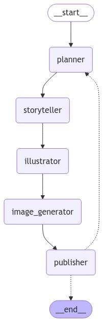

# modular-code-gen

## Setup

- Install OpenAI Version 0.28.1, this is required by Gorilla LLM
```bash
pip install openai==0.28.1 -t lib_v0.28.1
```

- Add OpenAI API key to environment
```bash
export OPENAI_API_KEY="sk-xxxxxxxxxxxxxxxx"
```

## Workflow Sketch




## Run app

>For the CLI
```bash
python main.py
```

>For the GUI
```bash
python ui.py
```

## Steps to Implement a New Agent [🔗 file](workflows/workflow.py)

### 1. Define Entry Point Function
- **Task:** Define an entry point function `execute_step_for_{}` for the {} team, similar to `execute_step_for_database`.
- **Reference:** Line 261.

### 2. Define `executeAction_for_{}_team`
- **Task:** Define the function `executeAction_for_{}_team` to execute the actions outlined by the {} agent, similar to `executeAction_for_database_team`.
- **Reference:** Line 284.

### 3. Implement `re_execute_step_for_{}` Function
- **Task:** Implement `re_execute_step_for_{}` similar to `re_execute_step_for_database`. This function will call the `re{}_agent` to verify the task status and decide whether to redo or not.
- **Reference:** Line 307.

### 4. Implement `validationFor{}Team` Function
- **Task:** Implement `validationFor{}Team`, similar to `validationForDatabaseTeam`.
- **Reference:** Line 331.

### 5. Edit the Planner Node
- **Task:** Edit the `planner node` in line 62 to add the new agent.
- **Action:** Modify the `if` block to include the new agent.

### 6. Edit `executeStage`
- **Task:** Edit the `executeStage` function in line 116 to include the new agent.
  - **Actions:** 
    - Update the `Literal[]`.
    - Modify the `if` block to accommodate the new agent.

### 7. Edit `colabEnd` Function
- **Task:** Edit the `colabEnd` function in line 239 to include the new agent.
- **Action:** Add a corresponding `if` statement.

### 8. Connect Functions with LangGraph Tags
- **Task:** Connect the created functions to their LangGraph tags by creating `nodes` using the `add_node` method.

### 9. Create Connections Between Functions
- **Task:** Create connections between the functions by adding `edges` using `add_edge` or `add_conditional_edge`.

### 10. Edit `replan_step` Function
- **Task:** Edit the `replan_step` function in line 202 to include the new agent.
- **Action:** Add the necessary `if` statement.

