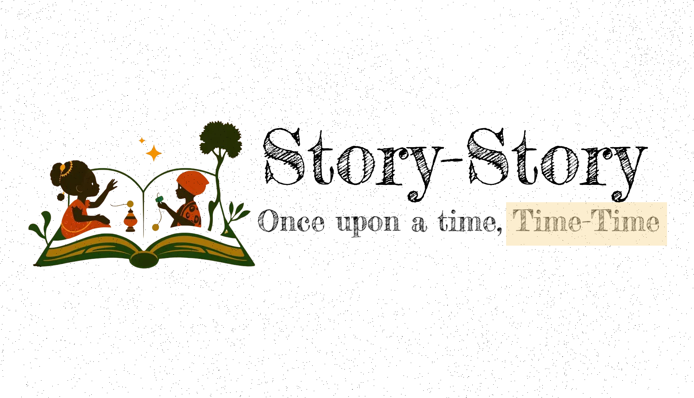

# Story-Story: Once upon a time, Time-Time!



**Story-Story** is an engaging storytelling app designed for children. It takes the rich histories of Nigerian and African figures and turns them into child-friendly, factual stories. With vibrant illustrations and captivating narratives, Story-Story aims to make history come alive for young minds. Stories are generated using an LLM agentic workflow, see demo [here](https://naija-heroes.vercel.app).

---

## 🏗️ Architecture

**Story-Story** uses an ensemble of AI LLM agents implemented with **LangGraph** to generate entire 10-page stories about a hero from a single input (the hero's name).

Below is the architecture


## 🤖 Agents Breakdown

1. Planner Agent
   - Responsible for generating the outline / chapter titles for the story
   - **input**: `historical_figure`
   - **output**: `chapter_title`
   - model: Gemini-1.5-Flash
2. Storyteller Agent (Gemini-1.5-Flash)
   - Responsible for generating accurate content for the chapter
   - **input**: `historical_figure` `chapter_title`
   - **output**: `chapter_content`
   - model: Gemini-1.5-Flash
3. Illustrator Agent
   - Responsible for generating prompts that will be used to generate images
   - **input**: `chapter_title` `historical_figure`
   - **output**: `prompt`
   - model: Gemini-1.5-Flash
4. Image Creator
   - Responsible for generating the illustrations given a prompt
   - **input**: `historical_figure` `prompt`
   - **outputs**: `image`
   - model: Flux.1 Schnell
5. Publisher Agent
   - Responsible for verifying validity of outputs, making sure it's okay for child consumption
   - **inputs**: `historical_figure` `chapter_content` `image`
   - **outputs**: `score`
   - model: Gemini-1.5-Flash

---

## 🚀 Getting Started
- Install requirements
```bash
pip install -r requirements.txt
```

- Add Google Gemini API Key to environment
```bash
export GOOGLE_API_KEY="sk-xxxxxxxxxxxxxxxx"  
```

## 🖥️ Run app
```bash
python main.py --historical_figure "Ahmadu Bello"
```
This will create the `10-page` content including illustrations about Ahmadu Bello and upload to a `Supabase` database

## 📦 Database Structure

The app uses Supabase for storing story-related data. Here's a brief schema overview:

### Tables
1. Stories:

- `id`: Primary Key
- `title`: Title of the story
- `historical_figure`: Name of the figure
- `description`: Brief description
- `created_at`: Timestamp

2. StoryPages:

- `id`: Primary Key
- `story_id`: Foreign Key (References Stories)
- `page_number`: Page number in the story
- `chapter`: Chapter content
- `illustration_url`: URL for the illustration
- `prompt`: Prompt used to generate illustrations

## 🤝🏾 Contributing
Contributions are highly welcome! 

Here are ideas I am currently working on
- [x] Illustrations
- [ ] Add reference store so storyteller agent can perform RAG
- [ ] Narrator
